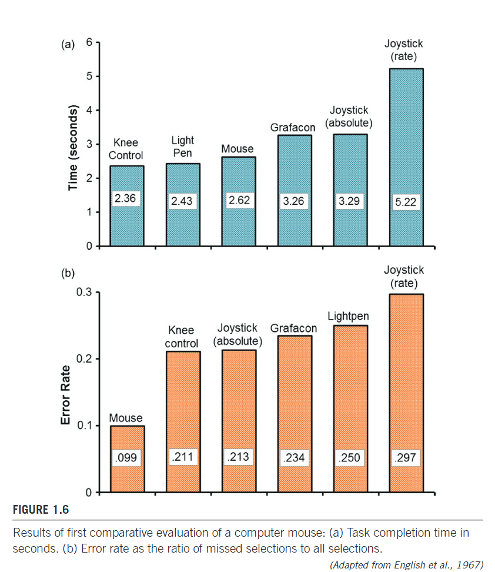

# Chapter 1 Historical Context

MacKenzie, I.S. (2013). Chapter 1: Historical Context. Human-Computer Interaction: An Empirical Research Perspective. (pp. 1-26). Waltham, MA: Elsevier.Norman, D. (2013).

First humans, 1940s computers, then 1980s interaction. Between 1940-1980 computers were very precious and many humans did not interact with them.

*Interaction was not on the minds of the engineers and scientists who designed, built, configured, and programmed the early computers.*

## 1.1 Introduction

Although HCI emerged in the 1980s, it owes a lot to older disciplines: human factors, or ergonomics.

Human factors is both a science and a field of engineering. It is concerned with human capabilities, limitations, and performance, and with the design of systems that are efficient, safe, comfortable, and even enjoyable for the humans who use them.

It is also an art in the sense of respecting and promoting creative ways for practitioners to apply their skills in designing systems.

> HCI, then, is human factors, but narrowly focused on human interaction with computing technology of some sort.

HCI is tremendously broad in scope.

Figure 1.1 presents a timeline of a few notable events leading to the birth and emergence of HCI as a field of study, beginning in the 1940s.

## 1.2 Vannevar Bush’s “as we may think” (1945)

Vannevar Bush’s published prophetic essay “As We May Think,” in the Atlantic Monthly in July, 1945

Bush was the U.S. gov’s Director of the Office of Scientific Research and a scientific advisor to President Franklin D. Roosevelt. During World War II, he was charged with leading some 6,000 American scientists in the application of science to warfare. But Bush was aware of the possibilities of these applications during peacetime.

> The summation of human experience is being expanded at a prodigious rate, and the means we use for threading through the consequent maze to the momentarily important item is the same as was used in the days of square-rigged ships (Bush, 1945)

Aside from the ”square-rigged ships”, what Bush says we can fully relate to today, especially his mention of the expanding human experience in relation to HCI.

Bush proposed navigating the knowledge maze with a device he called *memex*. Among the features of memex is associative indexing, whereby points of interest can be connected and joined so that selecting one item immediately and automatically selects another: “When the user is building a trail, he names it, inserts the name in his code book, and taps it out on his keyboard” (Bush, 1945) (Similar to hyperlinks and bookmarks).

Bush’s inspiration for this idea came from the contemporary telephone exchange, which he described as a “spider web of metal, sealed in a thin glass container” (viz. vacuum tubes)

## 1.3 Ivan Sutherland’s Sketchpad (1962)

(a) Demo of Ivan Sutherland’s Sketchpad. (b) A light pen dragging (“rubber banding”)
lines, subject to constraints.

Ivan Sutherland developed Sketchpad in the early 1960s as part of his PhD research in electrical engineering at the Massachusetts Institute of Technology (M.I.T.)

Sketchpad was a graphics system that supported the manipulation of geometric shapes and lines (objects) on a display using a light pen.

With Sketchpad, commands were not typed. Users did not “write letters to” the computer. Instead, objects were drawn, resized, grabbed and moved, extended, deleted—directly, using the light pen.

The use of a pointing device for input makes Sketchpad the first direct manipulation interface. The term “direct manipulation” was coined many years later by Ben Shneiderman to provide a psychological context for a suite of related features that naturally came together in this new genre of human–computer interface (Shneiderman, 1983).

After the Sketchpad soon followed, most notably the Dynabook concept system by Alan Kay of the Xerox Palo Alto Research Center (PARC)

A user study was not concluded on the sketchpad as Sutherland was a student of electrical engineering.

## 1.4 Invention of the mouse (1963)

Invented by Douglas Engelbart in 1963, the mouse was destined to fundamentally change the way humans interact with computers.

Instead of typing, a user could use a mouse to control the on-screen cursor.

An early hypertext system called NLS, for online System, was the project for which an improved pointing device was needed. Specifically, the light pen needed to be replaced.

(a) The first mouse. (b) Inventor Douglas Engelbart holding his invention in his left hand and an early three-button variation in his right hand

The device included two potentiometers positioned at right angles to each other. Large metal wheels were attached to the shafts of the potentiometers and protruded slightly from the base of the housing.

The wheels rotated as the device was moved across a surface. Side-to-side motion rotated one wheel; to-and-fro motion rotated the other. With diagonal movement, both wheels rotated, in accordance with the amount of movement in each direction. 

The amount of rotation of each wheel altered the voltage at the wiper terminal of the potentiometer. The voltages were passed on to the host system for processing. The x and y positions of an on-screen object or cursor were indirectly controlled by the two voltage signals.

Initial testing of the mouse focused on selecting and manipulating text, rather than drawing and manipulating graphic objects. **Known as HCI’s first user study**. Besides the mouse, the comparison included a light pen, a joystick, a knee-controlled lever, and a Grafacon.

Additional devices used in the first comparative evaluation of a mouse: (a) Joystick. (b) Lightpen. (c) Knee-controlled lever. (d) Grafacon.

Operating the device away from the display meant some form of on-screen tracker (a cursor) was needed to establish correspondence between the device space and the display space. While this seems obvious today, it was a newly emerging form of human-to-computer interaction in the 1960s.

### Comparative Evaluation, English et al. (1967)

- measured users’ access time (the time to move the hand from the keyboard to the device)
- motion time (the time from the onset of cursor movement to the final section)
- had 13 participants (3 of which inexperienced with the device)
- marks an important milestone in empirical research in HCI (what most researchers would say is a good conference presentation and publication)
- Below is data from inexperienced users

## Xerox star (1981)

- National Computer Conference (NCC)
- Xerox star at NCC, first commercially released computer with a GUI
- bit-mapped display
- cost $16000 for the workstation

- Star was intended as an office automation system
- used desktop metaphor (metaphor is important in HCI, user has a jump-start on knowing what to do)
- The desktop metaphor brings concepts from the office desktop to the system’s display. Ex: windows, printers, and trashcan.

In making the system usable (invisible), the Star developers created interactions that deal with files, not programs. So users “open a document,” rather than “invoke an editor.”

**A continuous property**, such as display brightness or sound volume, has a continuous control, such as a slider. 

**A discrete property**, such as font size or family, has a discrete control, such as a multi-position switch or a menu item.

Command-line interfaces, by comparison, are simple. They follow a software paradigm known as **sequential programming**. Every action occurs in a sequence under the system’s control.

- windows, icons, menus, and a pointing device (WIMP)
- event-driven programming: when user is in control

The central ingredients were a new object-oriented programming language known as Smalltalk and a software architecture known as Model-View-Controller.

## 1.6 Birth of HCI (1983)

three key events:

- the first ACM SIGCHI conference
- the publication of Card, Moran, and Newell’s The Psychology of Human-Computer Interaction (1983)
- Arrival of the Apple Macintosh

### 1.6.1 First ACM SIGCHI Conference (1983)

Special Interest Group on Social and Behavioral Computing (SIGSOC)

> The ACM Special Interest Group on Computer-Human Interaction is the world’s largest association of professionals who work in the research and practice of computer-human interaction.

- CHI papers have high visibility, meaning they reach a large community of researchers and practitioners in the field.
- One indication of the quality of the work is *impact*, the number of citations credited to a paper.

These include the annual:

- ACM Symposium on User Interface Software and Technology (UIST)
- specialized conferences such as the ACM Symposium on Eye Tracking Research and Applications (ETRA)
- the ACM Conference on Computers and Accessibility (ASSETS)
- regional conferences such as the Nordic Conference on Computer-Human Interaction (NordiCHI).

### 1.6.2 The psychology of human-computer interaction (1983)

**Applied Information-Processing Psychology Project (AIP)**

The AIP mission was “to create an applied psychology of human-computer interaction by conducting requisite basic research within a context of application.

**model human processor (MHP)**

connecting low-level human processes with the seemingly innocuous interactions humans have with computers.

Card, Moran, and Newell adapted information processing models of human behavior to interactive systems.

- keystroke-level model (KLM)
- goals, operators, methods, and selection rules model (GOMS)

The interaction (just described, texting) is a type of simple decision known as physical matching. The reader is walked through the solution using the model human processor to illustrate each step, from stimulus to cognitive processing to motor response.

There are four low-level processing cycles: a perceptual processor cycle (tP), two cognitive processor cycles (tC), and a motor processor cycle (tM).

### 1.6.3 Launch of the Apple Macintosh (1984)

- Ad on superbowl day, was 60 second using Orwell’s Nineteen Eighty-Four as a theme

### 1.8 Growth of HCI Research

### 1.9 Other readings

Two other papers considered important in the history of HCI are:

- “Personal Dynamic Media” by A. Kay and A. Goldberg (1977). This article describes Dynabook. Although never built, Dynabook provided the conceptual basis for laptop computers, tablet PCs, and e-books.
- “The Computer for the 21st Century” by M. Weiser (1991). This is the essay that presaged ubiquitous computing. Weiser begins, “The most profound technologies are those that disappear. They weave themselves into the fabric of everyday life until they are indistinguishable from it” (p. 94).

Other sources taking a historical view of human-computer interaction include: Baecker, Grudin, Buxton, and Greenberg, 1995; Erickson and McDonald, 2007; Grudin, 2012; Myers, 1998.