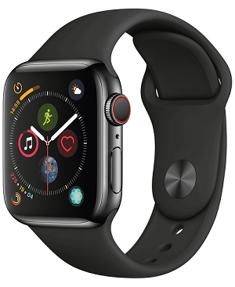

# Chapter 1: The Psychopathology of Everyday Things

Have you ever came up to a door and were confused on how to open it? Do you push, do you pull, do you slide? Or maybe the signage is actually different from what is necessary to open the door. This phenomenon is often called **Norman doors**, and they can be frustrating.

Doors should indicate how it works without the need for signs, and especially without trial and error.

Two of the most important characteristics of good design:

- Discoverability: Is it possible to even figure out what actions are possible and where and how to perform them?
- Understanding:  What does it all mean? How is the product supposed to be used? What do all the different controls and settings mean?

## The Complexity of Modern Devices

All things are designed, books, lectures, bridges. Even artificial ones, like paths, layout of furniture.

The book focuses on 3 major areas of design: industrial, interactive, and experience design.

**Industrial design**: The professional service of creating and developing concepts and specifications that optimize the function, value, and appearance of products and systems for the mutual benefit of both user and manufacturer (from the Industrial Design Society of America’s website).

**Interaction design**: The focus is upon how people interact with technology. The goal is to enhance people’s understanding of what can be done, what is happening, and what has just occurred. Interaction design draws upon principles of psychology, design, art, and emotion to ensure a positive, enjoyable experience.

**Experience design**: The practice of designing products, processes, services, events, and environments with a focus placed on the quality and enjoyment of the total experience.

When people fail to follow specific rules of a machine, usually the operator is blamed for this. When applied to our everyday objects, the result is frustration.

With complex devices and commercial and industrial processes, the resulting difficulties can lead to accidents, injuries, and even deaths.

The reasons for these deficiencies in human-machine interaction are numerous:

- Technological limitations
- Self imposed restrictions by the designers (such as cost and material)
- Lack of understanding of the design principles necessary for effective ‘Human Machine Interaction.

Why this deficiency?
> Because much of the design is done by engineers who are experts in technology but limited in their understanding of people.

## Human-Centered Design

People are frustrated with everyday things.

Each new development seems to repeat the mistakes of the earlier ones; each new field requires time before it, too, adopts the principles of good design.

The solution is human-centered design (HCD), an approach that puts human needs, capabilities, and behavior first, then designs to accommodate those needs, capabilities, and ways of behaving.

**Good design starts with understanding psychology and technology.**

**Good design requires good communication.**

## Fundamental Principles of Interaction

Great designers produce pleasurable experiences.

Experience is critical, for it determines how fondly people remember their interactions. Are they happy, sad, frustrated?

Discoverability results from appropriate application of six fundamental psychological concepts: *affordances, signifiers, constraints, mappings, feedback, and conceptual model.*

### Affordances

- refers to the relationship between a physical object and a person. (or any interacting agent)

An affordance is a relationship between the properties of an object and the
capabilities of the agent that determine just how the object could possibly be used.

For example, a chair affords (’is for’) support, and affords sitting.

If something cannot be afforded, a task cannot be complete (for example, a baby cannot afford to pick up a chair).

The notion of affordance and the insights it provides originated with *J. J. Gibson*, an eminent psychologist who provided many advances to our understanding of human perception.

The author disagreed with J.J. Gibson on almost everything. The author was an engineer who became a cognitive psychologist, and Gibson was a Gestalt psychologist and developed Gibsonian psychology, an ecological approach to perception.

He argued that the world contained the clues and that people simply picked them up through “direct perception” and the author argued that nothing could be direct: the brain had to process the information arriving at the sense organs to put together a coherent interpretation.

“Information pickup” was one of his favorite phrases, and Gibson believed that the combined information picked up by all of our sensory apparatus—sight, sound, smell, touch, balance, kinesthetic, acceleration, body position—determines our perceptions without the need for internal processing or cognition.

### Signifiers

>Signifiers communicate where the action should take place.

People need:

- some way of understanding the product or service they wish to use
- some sign of what it is for
- what is happening
- what the alternative actions are.

What people need, and what designers must provide, are signifiers.

Signifiers can be deliberate and intentional, such as the sign on a door, but they may also be accidental and unintentional, such as a visible trail made by previous people walking through.

The author describes that the doors in the image above are not marked with any signs or signifiers, meaning the user has to try through trial and error.

Another design of a sliding door provided by the author that shows that the handle needs to be turned to slide, but a user may easily think that this is a pull/push handle.

To summarize:

- Affordances are the possible interactions between people and the environment. Some affordances are perceivable, others are not.
- Perceived affordances often act as signifiers, but they can be ambiguous.
- Signifiers signal things, in particular what actions are possible and how they should be done. Signifiers must be perceivable, else they fail to function.

In design, signifiers are more important than affordances, for they communicate how to use the design.

### Mapping

>the relationship between the elements of two sets of things

Mapping is an important concept in the design and layout of controls and displays.

When the mapping uses spatial correspondence between the layout of the controls and the devices being controlled, it is easy to determine how to use them.

In steering a car, we rotate the steering wheel clockwise to cause the car to turn right: the top of the wheel moves in the same direction as the car.

Seat controls like the above provide a great mapping relationship as the user is able to understand which buttons control which part of the seat.

The relationship between a control and its results is easiest to learn wherever there is an understandable mapping between the controls, the actions, and the intended result.

Natural mapping leads to immediate understanding. For example, to move an object up, move the control up.

Groupings and proximity are important principles from Gestalt psychology that can be used
to map controls to function: related controls should be grouped together. Controls should be close to the item being controlled.

### Feedback

>Feedback—communicating the results of an action—is a well- known concept from the science of control and information theory.

Feedback must be immediate: even a delay of a tenth of a second can be disconcerting. If the delay is too long, people often give up, going off to do other activities.

Poor feedback can be worse than no feedback at all, because it is distracting, uninformative, and in many cases irritating and anxiety-provoking. (Lights, noises, user cannot be sure where this came from)

Poor design of feedback can be the result of decisions aimed at reducing costs, even if they make  life more difficult for people.

Feedback must be planned, prioritized, essential, and appropriate.

### Conceptual Models

>A conceptual model is an explanation, usually highly simplified, of how something works.

Files, folders, and icons, help users create the conceptual model.

The conceptual model is of one, coherent image, whereas it may actually consist of parts, each located on different machines that could be almost anywhere in the world. This is why this model can be confusing to users, when their items exist on the cloud but don't show up when things are not working.

Mental models, as the name implies, are the conceptual models in people’s minds that represent their understanding of how things work.

Conceptual models are often inferred from the device itself. (Ex. Scissors)

A good conceptual model allows us to predict the effects of our actions.

The image above is an example of a bad design. The author finds out through lots of research that the knobs are correlated, and the user needs 24 hours between each 'trial and error' making this a very frustrating design and model.

## The System Image

The system image is what can be perceived from the physical structure that has been built (including documentation, instructions, signifiers, and any information available from websites and helplines).

Good conceptual models are the key to understandable, enjoyable products: good communication is the key to good conceptual
models.

## The Paradox of Technology

Technology can make life easier and more enjoyable, but the added complexities increase our difficulty and frustration with technology.

Modern watches can do many things: tell time, day, month, year, provide a stopwatch, even a radio. With this in mind, how can all these functions fit into a small wearable size? A cellphone fixes this problem for some.

The book was published in 2013, and the first apple watch released in 2015, solving even more problems the author mentioned. However, his speculation was that it would complicate it for users, which is the case for the apple watch.

> The same technology that simplifies life by providing more functions in each device also complicates life by making the device harder to learn, harder to use. This is the paradox of technology and the challenge for the designer.

## The Design Challenge

Design requires a lot of cooperation with: designers, management, etc.

Each discipline has a different perspective of the relative importance of the many factors that make up a product.

The hard part is to convince people to understand the viewpoints of the others, to abandon their disciplinary viewpoint and to think of the design from the viewpoints of the person who buys
the product and those who use it, often different people.

No matter how great the product is, if it doesn’t sell for whatever reason, the company has to stop selling it.

The needs of those concerned are different and often conflict.

> The challenge is to use the principles of human-centered design to produce positive results, products that enhance lives and add to our pleasure and enjoyment. The goal is to produce a great product, one that is successful, and that customers love. It can be done.
>