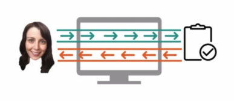
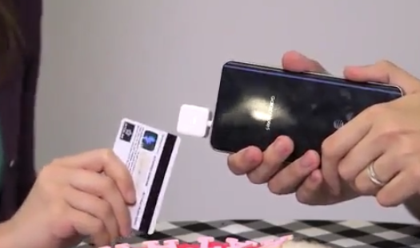
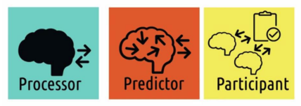
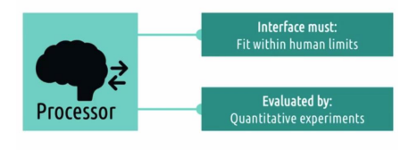
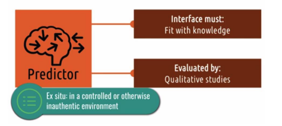
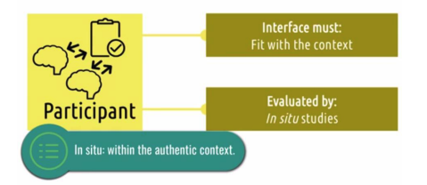
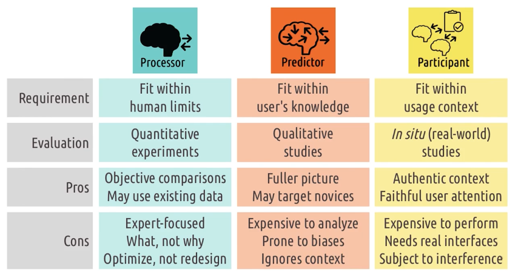
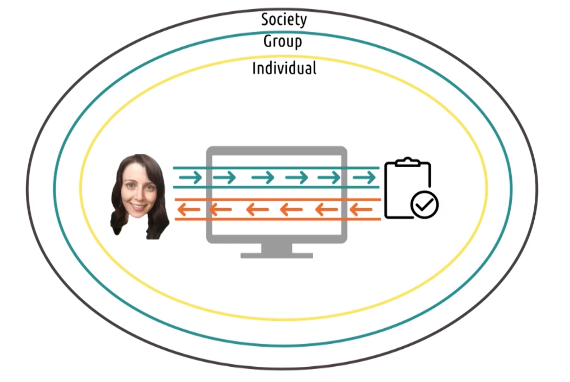

# 2.1 Introduction to principles

In this section we are talking about the overarching principles of design. Here is an overview.

- Focus is on users and tasks, not tools and interfaces on their own.
- The role of the interface in mediating users and tasks.
- Views on the user's role in the system.
  - Processor vs. predictor vs. participant
- The user experience
  - The user experience exists at different levels.

## Interfaces: Between Users and Tasks

**Users use interfaces to accomplish some task.** Remember this diagram.

A pencil is an example of a non-computational interface for the task of writing. In HCI we just focus on computational interfaces. Even though we are designing interfaces, we don't overly fixate on the interface itself. **The interface is just a way of accomplishing the task.**

In the picture below we have a traditional thermostat on the left and a nest thermostat on the right. The traditional thermostat is an interface that allows a user to control the temperature. The nest thermostat learns from its user and begins to automatically change the temperature.

The nest is more than an interface for controlling whether the heat or the air conditioning is on. The nest is an interface for controlling the temperature in an area. Designing for the task allows us to innovate beyond just making small iterative improvements to the layout of buttons.

## Quiz: Identifying a task

What is the task going on here?

If you said she's swiping her credit card, you're thinking a little too narrowly. Swiping her credit card is
just how she accomplishes her task.

Her task is purchasing an item. Putting emphasis on the task allows us to think more generally about how to make an interface better.

## 5 Tips: Identifying a Task

1. Watch real users
2. Talk to users
3. Start small. Don't come in thinking you already understand the task. Understand little individual interactions.
4. Abstract up.
   - Start from the smaller interactions and abstract your way up to the task you are trying to complete.
   - _Why is she swiping the credit card?_ To make a purchase. _Why?_ To buy some goods. _Why?_ To repair her car.
     - Somewhere in here is the task you are designing for.
5. You are not your user.
   - Even if you perform the task that you are designing for, you are not your user. Your user is everybody that has to complete this task.
   * Leave behind your previous experiences and preconceived notions.

## Usefulness and usability

The ultimate goal of design in HCI is to create interfaces that are -

- Useful
- Usable

Usefulness is a pretty low bar. A map is usefulm but it isn't the most usable thing in the world. You have to keep track of where you are and plot your own route.

Navigation apps are much more usable. This is why we focus on the task. If we tried to improve a paper map, we wouldn't end up with a navigation app.

It was through understanding the task of navigation itself that we realized we could offload a lot of the
cognitive load of navigation onto the interface, closing the loop between the user and the task of
navigation.

## Views of the user: Processor, Predictor, Participant

Let's talk about three different possible types of roles the human can play -

- processor
- predictor
- participant

### Processor

First, we might think of the human as being nothing more than a sensory processor. They take input in
and they spit output out. They're kind of like another computer in the system, just one that we can't
see the inside of.

If we are designing with this role in mind then our main concern is that the interface
fit within known human limits. These are things like what humans can sense, what they can store in
memory, and what they can physically do in the world. In this case, usability means that the interface is
physically usable. User can see all the colors, touch all the buttons, and so on. With this model, we
evaluate our interfaces with quantitative experiments. That means we take numeric measurements on
how quickly the user can complete some task or how quickly they might react to some incoming
stimulus. Now, as you might have guessed, the processor view is not the one we'll generally take when
we talk about good design. Instead, we'll probably divide our time pretty equally between the other
two perspectives.

### Predictor

A second way of viewing the human is to view them as a predictor. Here, we care deeply about the
human's knowledge, experience, expectations, and their thought process. That's why we call them the
predictor. We want them to be able to predict what will happen in the world as a result of some action
they take. So we want them to be able to map input to output. And that means getting inside their
head. Understanding what they're thinking, what they're seeing, what they're feeling when they're
interacting with some task. If we're taking this perspective, then the interface must fit with what
humans know. It must fit with their knowledge. It must help the user learn what they don't already
know and efficiently leverage what they do already know. And toward that end, we evaluate these
kind of interfaces with qualitative studies. These are often ex situ studies. We might perform task
analyses to see where users are spending their time. Or perform cognitive walk-throughs to understand
the user's thought process throughout some task. We can see pretty clearly that this view gives us
some advantages over viewing the user simply as a sensory processor, just as another computer in the
system. However, here we're still focusing on one user and one task. And sometimes that's useful. But
many times we want to look even more broadly than that.

### Participant

A third view on the user is to look at the user as a participant in some environment. That means we're
not just interested in what's going on inside their head. We're also interested in what's going on around
them at the same time, like what other tasks or interfaces they're using, or what other people they're
interacting with. We want to understand for example, what's competing for their attention? What are
their available cognitive resources? What's the importance of the task relative to everything else that's
going on? So if we take this view, then our interface must fit with the context. It's not enough that the
user is able to physically use the system and knows how to use the system. They must be able to
actually interact with the system in the context where they need it.

Because context is so
important here, we evaluate it with in situ studies. We can't simply look at the user and the interface in
a vacuum. We have to actually view and evaluate them in the real world using the interface in
whatever context is most relevant. If we're evaluating a new GPS application, for example, we need to
actually go out and look at it in the context of real drivers driving on real roads. The information we get
from them using the app in our lab setting isn't as useful as understanding how they're going to actually
use it out in the real world. These are in situ studies, which are studies of the interface and the user
within the real complete context of the task.

## Views of the user and Psychological Schools of Thought

These views of the user can be traced back to the field of Psychology.

- **Processor**: Rooted in **behaviorism**. Focuses on behavior, not on cognition that underlies behavior. This corresponds to our processor model where humans are like a machine in a system.
  - John B. Watson responsible for little Albert experiment, where a little boy was conditioned to be afraid of rabbits as they were repeatedly paired with loud noises.
  * Ivan Pavlov discovered classical conditioning by conditioning dogs to salivate to the sound of a bell.
  * B. F. Skinner conditioned rats to press a button to receive food.

* **Predictor**: Rooted in **cognitivism** (or cognitive psychology). Cognitivism is concerned with what goes on inside the mind. Covers things like perception, attention, creativity, memory.

  - Philosophers like Rene Descartes and Immanuel Kant asked questions about if people are blank slates when they are born or if they are born with some innate knowledge.

  * In the cognitive revolution of the 1950s, cognitivism emerged as a foil to behaviorism. Cognitive science is sometimes considered separate from psychology, partially because of its roots in separate fields like AI, neuroscience, and linguistics.
  * Big names include the linguist Noam Chomsky, psychologist Susan Carey, and computer scientists John McCarthy, Marvin Minsky, Allen Newell, and Herbert Simon. In order to create computers that think like humans, computer scientists tried to understand how humans thought.
  * We ask questions like **what will the user predict will be the right action to take?**

* **Participant**: Resembles **functionalism** and **systems psychology**. Participant view is not so closely coupled to these schools of thought as our previous examples.
  - In our work, participant view largely comes out of original research in human factors engineering and HCI.
  * Processor and predictor view are only concerned with interactions between a user and an interface. **The participant view looks at the user and the interface in the context of a larger system.** It cares about a larger system.
  * Major names include:
    - Edwin Hutchins: distributed cognition
    - Lucy Suchman: situated action models, arguing we can't disentangle behavior from the environment where it takes place)
    - Gavriel Salomon: educational psychologist focused on how learning happens in context of culturally provided tools and implements
    - Bonnie Nardi: introduced activity theory. Analyzed looking at user and interface in the context of some larger activity.

We could go in much greater depth into any one of these areas, but that would be a different course.

## Pros and cons of the three views

The example given is inputting an address for a Tesla's navigation.

### Processor

We can just time our users on some different versions of the software, the best interface is the one with the fastest times.

- **Pros**:
  - Might be able to use existing data of the keystrokes of all users.
  - Enables objective comparisons, no interpretation is involved in saying "it takes 5.2 seconds to go from entering an address to starting navigation".

* **Cons**:
  - Doesn't find **reason** for differences. We can't tell why one interface is faster.
  - Can't differentiate by expertise. Usually processor model is working with experts, but it can't tell us what a novice finds confusing or misleading.
  * Helps optimize, not redesign.

### Predictor

Asks users for input. Interviews, focus groups, surveys. Maybe users find an icon to be misleading. Maybe users prefer voice while driving, but text while parked.

- **Pros**:
  - More complete picture of interaction
  - Targets different levels of expertise
- **Cons**:
  - Analysis can be expensive. We are now dealing with unstructured data like plain text interviews.
  * Analysis is subject to biases, especially if the researcher has confirmation bias.
  * Ignores the broader interaction context.

### Participant

Look at the user and interface in the broader context.

- **Pros**:
  - Evaluates interaction in context
  - Captures authentic user attention (are they distracted?)

* **Cons**:
  - Expensive to perform and analyze. We need to actually ride along with participants as they use our car GPS.
  - We need real, functional interfaces.
  * Subject to uncontrollable variables.

### How the models complement each other

- Processor isn't good for evaluating novice users, but the predictor model is.
- Predictor model doesn't easily allow for comparison, but the processor model does.
- Participant model gives us the full context, unlike the processor or predictor models.
- Participant model doesn't isolate against external variables, but the processor model does.

Use all the different models at different times and with different contexts.

## Good design vs. bad design

**Good design**: A GPS system that warns you 20 seconds before you have to make a turn.
**Bad design**: A GPS system that warns you 2 seconds before you have to make a turn.

Which view you take on the user can have a huge impact on the success of the interface.

If you view the user just as a **sensory processor**, you might think that we only need to alert
them a second before the upcoming turn because, after all, human reaction time is less than a second.

If you view the user as a **predictor**, you understand they need time to slow the car down and actually
make the turn. So they might need a few more seconds to execute the action of turning before being
alerted they need to turn.

And if you view the user as a **participant**, you'll understand this is happening
while they're going 50 miles down the road with a screaming toddler in the backseat, trying to merge
with the driver on a cell phone and the other one eating a cheeseburger. So it would probably be a
good idea to give them a few or more reminders before the turn and plenty of time to get in the right
position.

## Reflections: views of the user

### Question

Try to think of a time when a program, an app or a device
clearly treated you as each of these types of users for better or for worse.

### Answer

For me, we have a system at Udacity we use to record hours for those of us that work on some contract projects.
It asks us to enter the number of hours of the day we spend on each of a number of different
types of work. The problem is that, that assumes something closely resembling the **processor model**. A computer can easily track how long different processes take. But for me, checking the amount of time
spent on different tasks can be basically impossible. Checking my e-mails involves switching between five different tasks a minute. How am I suppose to track that? The system doesn't take into consideration a realistic view of my role in the system.

Something more similar to the **predictor view**
would be, well, the classroom you're viewing this in. Surrounding this video are a visual organization of the lesson's content, a meter measuring your progress through the video, representations of the
video's transcript. These are all meant to equip you with the knowledge to predict what's coming next.
This classroom takes a predictor view of the user. It offloads some of the cognitive load onto the
interface allowing you to focus on the material.

For the **participant view** I personally would consider my alarm
clock an example. I use an alarm clock app called Sleep. It monitors my sleep cycles, rings at the
optimal time and tracks my sleep patterns to make recommendations. It understand its role as part of a
broader system needed to help me sleep. It goes far beyond just interaction between me and an
interface. It integrates into the entire system.

## User Experience, Sans Design

By David Joyner's definition, UX design is attempting to create systems that dictate how the user will experience them. Preferably that the user will experience them positively.

UX in general (without design aspect), is a phenomenon that emerges out of the interactions between humans and tasks via interfaces. We might design this, but regardless of our design skills, it will exist. It is like the weather, there is never no weather, there is never no user experience.

The user experience exists on multiple levels. Society and groups of people experience technology, not just individuals.

### UX: Individual

User experience can involve things like the individual's age, sex, or race, personal experiences, gender, expectations for the
interface, and more. It goes beyond just designing an interface to help with a task. It touches on whether the individual feels like the interface was designed for them. It examines whether they're frustrated by the interface or joyous about it. Those are all parts of this user experience.

### UX: Group

We can start to think about how interfaces lead to different user experiences among social or work groups. For example, I've known that school reunions seem to be much less important to people who've graduated within the past 15 years. And I hypothesize it's because Facebook and email have played such significant roles in keeping people in
touch. It's fundamentally changed the social to group user experience.

### UX: Societal

Those effects can then scope all the way up to the societal level. Sometimes these are unintended. For example, I doubt that the
creators of Twitter, foresaw when they created their tool, how it would play a significant role in big societal changes like the Arab spring or, sometimes these might be intentional. For example, it was a
significant change when Facebook added new relationship statuses to its profiles to reflect things like civil unions. That simultaneously reflected something that was already changing at the societal level.
But it also participated in that change and helped normalize those kinds of relationships. And that then relates back to the individual by making sure the interface is designed such that each individual feels
like it's actually designed with them in mind. The options are there for them to feel like they're properly represented within the system. These are all components of the general user experience that we need to think about as we design interfaces.

## Design Challenge: Audio books on the walk to work

Morgan listens to mostly nonfiction audio books on the walk to work. She doesn't just want to listen, she wants to take notes and leave bookmarks.

### Questions

What does design look like, from the perspectives of viewing her as a -

- processor
- predictor
- participant

Also how might these designs affect -

- her as an individual
- her group of friends
- society as a whole if the design is very popular

### Answers

As a **processor** we might just look at what information is communicated, when, and how.

As a **predictor** we might look at how the interface meshes with Morgan's immediate needs.

As a **participant** we might look at how this interface and improved access to books impacts other parts of her life.

This task is too big to tackle right now, we will return to it frequently throughout the course to explore new concepts.

## Summary

We talked about

- Basics of HCI principles
- Interfaces mediate between users and tasks
  - Good interfaces allow the user to think about the **task not interface**
- Usability is a higher bar to pass than usefulness
  - Efficiency and user satisfaction contribute to usability
- Three different views on defining usability and evaluation
  - processor, predictor, participant
- User experience isn't just at an individual level, also at a group and societal level.
