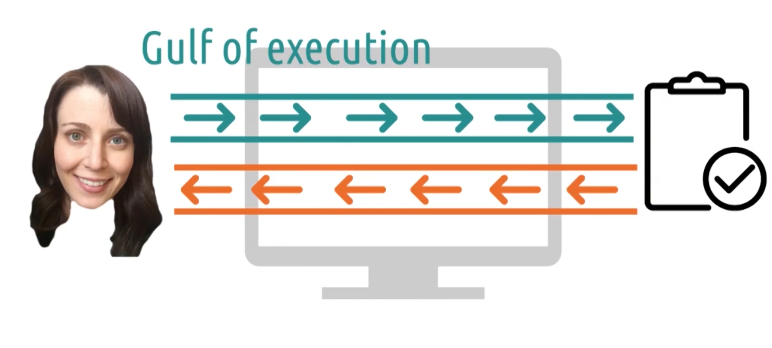
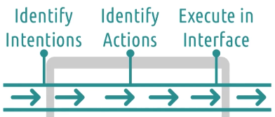
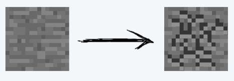
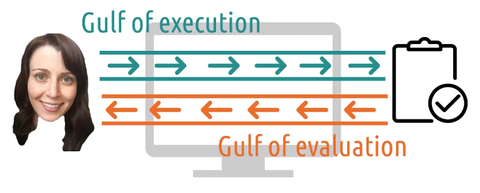
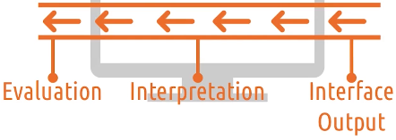
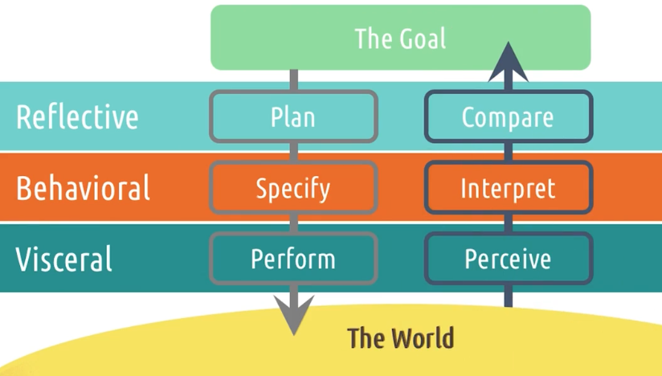
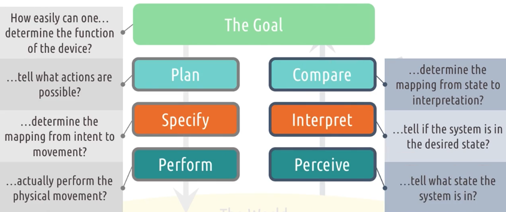

# Feedback Cycles

## Introduction to Feedback Cycles

Here is what we talk about in this section.

**Feedback cycles:** The way in which people interact with the world, and then get feedback on the results of those interactions. We'll talk about the ubiquity of those feedback cycles.

**Gulf of execution:** The distance between a user's goals and the execution of actions required to realize those goals.

**Gulf of evaluation:** Distance between the effects of those actions and a user's understanding of those results.

**Seven questions for designing feedback cycles**

**Everyday applications of feedback cycles**.

## Feedback Cycles are fundamental

Feedback cycles are incredibly ubiquitous, whether or not there's a computational interface involved.
Everything from reading to driving a car to interacting with other people could be an example of a
feedback cycle in action. They're how we learn everything, from how to walk to how to solve a Rubik's
cube to how to take the third order partial derivative of a function.

**We do something, we see the result, and we adjust what we do the next time accordingly.** You may have
even seen other examples of this before, too.

Feedback cycles show up in the knowledge-based AI and cyber-physical systems courses at GA tech.

Some definitions of intelligence define feedback cycles as the hallmark of intelligent behavior.

> _A person possesses intelligence insofar as he has learned, or can learn, to adjust himself to his environment._ - S. S. Colvin

> _The capacity to learn or to profit by experience._ - W. F. Dearborn

> _Any system that generates adaptive behavior to meet goals in a range of environments._ - D. Fogel

> _Intelligence means getting better over time._ - R. Schank

## Gulf of Execution

In our feedback cycle diagram there are two central challenges.

1. The user's interaction with the task through the interface
2. The task's return to the user of output via the interface

This first challenge is called the **gulf of execution**.

The user has some goals. **How do they figure out how to make those goals a reality?** There are several components to this.

1. **Identify intentions**
2. **Identify actions**
3. **Execute the actions**

### Example

David Joyner explains some ways to use a particular microwave.

- You could press `Time Cook`, then `1`, `0`, `0`, then `start`.
  - This is easy to discover for a new user.
- You could just press `1` and wait, the microwave will start cooking for 1 minute.
  - This is harder to discover, but easier to use.

But the actual goal is to heat up some leftover chili.

- You can press `Automatic Reheat` and it will reheat the food.
  - This can be discovered, but the user has to reframe their intention if they are not used to a microwave with this feature.

### 5 tips: Gulfs of Execution

1. Make functions discoverable
   - Should be clearly labeled on the interface
2. Let the user mess around
   - Don't include any actions that are irreversible, user should be comfortable pressing all sorts of buttons.
3. Be consistent with other tools
   - Standardize icons and keyboard shortcuts.
4. Know your user
   - **Discoverability is valuable to novices**, they need interfaces to be clearly labeled.
   - **Efficiency is more valuable to experts**, this is often why they use the command line.
5. Feedforward
   - Let user know what will happen if they keep doing what they are doing.
   - When a block is partially broken in minecraft, it shows cracks

## Gulf of Evaluation

The task must communicate the results of the user's actions back to the user. This is the **gulf of evaluation**.

Just like the gulf of execution, there are three components.

1. **Interface Output**
2. **Interpretation**
3. **Evaluation**

### Example

You increase the temperature on a thermostat to try to heat up a room. **How do you know it is working?**

Maybe you hear a noise or you can put your hand up to a heating vent and feel the warm air. But these things are less than ideal.

One thing we can do is to mark on the thermostat that the heat is on.

This solves the problem, but what if the heat isn't on and the temperature isn't as high as you want it to be? Why isn't the heat on? Is the heater broken? Is the interface broken? Do we need to change from AC mode to heater mode? Maybe we need another indicator to let the user know that they need to change the mode.

### 5 tips: Gulfs of Evaluation

1. Give feedback constantly.
   - Let the user know where they are in the process by giving feedback at every step.
2. Give feedback immediately.
   - Even if a system isn't fully ready to process a user's input, let the user know that their input has been received.
3. Match feedback to the action.
   - Significant actions should have significant feedback, subtle actions subtle feedback.
4. Vary your feedback.
   - Try giving auditory or haptic feedback if it makes sense. Visual feedback might get in the way of user inputs if there is limited space on the screen.
5. Leverage direct manipulation
   - Drag-and-drop interfaces, or pulling the corner of an item to resize it are both examples of direct manipulation.

## Norman's Feedback Cycles

## Good Design vs. Bad Design: Feedback Cycles

- **Good design:** A phone that quietly clicks each time you press a letter
- **Bad design:** A phone that loudly shouts each letter you press

Small actions get small feedback.

## Reflections: Feedback cycles

### Prompt

Try to think of a time when you've encountered a wide

1. gulf of execution
2. gulf of evaluation

### Answers

- **gulf of execution:** I have this electronic bicycle pump that has 4 buttons on it. I wish there was just a single button that turned on and off the pump.
- **gulf of evaluation:** This bicycle pump displays the air pressure, but if it didn't, that would be a wide gulf of evaluation.

## Feedback cycles in David's car

### Placement of the start button

In David's electric car, the start button is placed slightly to the right below the steering wheel. Why?

- [ ] It's closest to the engine, meaning the car will start faster
- [ ] It's where the user expects the button to be
- [ ] This location avoids accidentally turning the car off or on

**answer:**

Before cars had push button starts, this is where you inserted the key to turn on the ignition. Nowadays, the button could be placed anywhere. We keep the button in the same place to **help users across the gulf of execution by designing a system that's consistent with their expectations**.

Sometimes we break away from user's expectations to pursue other benefits, but generally, stay consistent with what users expect.

### Start noise

The car makes a happy beeping noise when you press the start button, even though the car didn't start. To actually start the car you need to press the brakes while pressing the start button, then there will be two happy beeps instead of one.

When you don't press the brakes, there is a display that tells you to press the breakes while starting the car. This is helping us with the gulf of evaluation.

Question: How can you reduce the gulfs of execution and evaluation.

Answers:

- **reduce the gulf of execution** by displaying "press the brakes while pressing start to start the car" as soon as the user enters the car.
- **reduce the gulf of evaluation** by not making a happy beeping sound when you press the button without having your foot on the steering wheel. Maybe make a sad beeping noise.

## Seven Questions for Bridging Gulfs

These are from "Design of Everyday Things" by Don Norman.

1. **Interpret**: How easiy can one determine the function of the device?
2. **Discern**: How easily can one tell what actions are possible?
3. **Identify**: How easily can one determine the mapping from intention to physical movement?
4. **Perform**: How easily can one perform that physical movement?
5. **Observe**: How easily can one tell what state the system is in?
6. **Compare**: How easily can one tell if the system is in the desired state?
7. **Interpret**: How easily can one determine the mapping from system state to interpretation?

## Exploring HCI: feedback cycles

Remember how you are supposed to pick an area (see section 1.3) and think about this area throughout the course?

How can you apply feedback cycles to your area of interest?

## Feedback cycles: credit card reader

Swiping credit cards can be difficult because maybe it fails because you are too fast or too slow, but you don't know which one. So you might end up slowing down your swipe, when really you need to speed up.

This is avoided by inserting the credit card. But then people can walk away without taking their card. Maybe the machine should beep to remind the person to take the card back. Or maybe don't let them finish the purchase without removing the card.

Remember that the **underlying task is to buy goods**. Methods like [Google Pay](<https://en.wikipedia.org/wiki/Google_Pay_(payment_method)>) allow you to tap your phone on a screen to pay, which is a better user experience.
